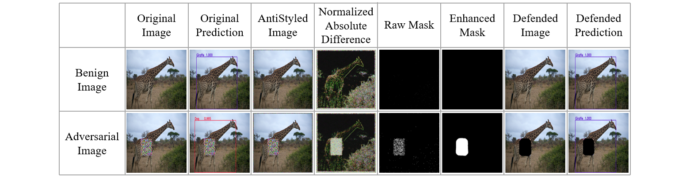
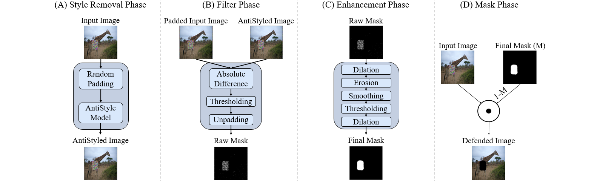
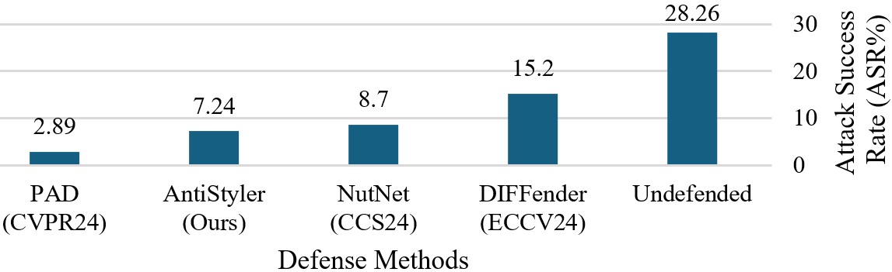

# AntiStyler: Defending Object Detection Models Against Adversarial Patch Attacks Using Style Removal

**Idan Yankelev¹, Edita Grolman¹, Yarin Yerushalmi Levi¹, Amit Giloni², Omer Hofman², Toshiya Shimizu³, Yuval Elovici¹, Asaf Shabtai¹**

¹Ben-Gurion University of the Negev &nbsp;&nbsp; ²Fujitsu Research of Europe &nbsp;&nbsp; ³Fujitsu Limited

{idanyan, edita, yarinye}@post.bgu.ac.il &nbsp;&nbsp; {elovici, shabtai}@bgu.ac.il
{amit.giloni, omer.hofman, shimizu.toshiya}@fujitsu.com

> This CVPR paper is the Open Access version, provided by the Computer Vision Foundation. Except for this watermark, it is identical to the accepted version; the final published version of the proceedings is available on IEEE Xplore.

---

## Abstract

Adversarial patch attacks pose a significant threat to the reliability of object detection (OD) models, particularly in real-time security applications. Although several defenses have been proposed, they often suffer from two limitations: 1) reduced performance on benign images, and 2) impractical processing time for real-time OD applications. In this paper, we present AntiStyler, a novel and rapid defense against adversarial patches. Given an input image, AntiStyler identifies and masks pixels that exhibit a "random" style associated with adversarial attacks and applies a series of spatial filters to refine the mask and remove unwanted noise, efficiently masking adversarial patches. AntiStyler features model-, patch-, and attack-agnostic capabilities and does not require training, making it a fully agnostic zero-shot defense against adversarial patch attacks. Our evaluation on the COCO, INRIA, Superstore, and APRICOT datasets, with both digital and physical attacks, demonstrates AntiStyler's state-of-the-art robustness (improving adversarial performance by 8-15 mAP%) without compromising the original performance on benign images. Additionally, unlike most existing defenses, AntiStyler can process 10-12 frames per second (FPS), making it efficient and relevant for real-time OD applications. Our code is available at [https://github.com/IdanYankelev/AntiStyler](https://github.com/IdanYankelev/AntiStyler).

---

## 1. Introduction

In the field of computer vision, the object detection (OD) task consists of the localization and classification of objects within a scene [43]. Similar to other deep neural network models, OD models are vulnerable to adversarial attacks, particularly adversarial patch attacks [39]. These attacks pose a significant threat to the reliability of an OD model by inserting a maliciously crafted patch onto an image, causing the model to make incorrect predictions. While several defenses have been proposed over the years [17, 21, 27, 32, 45], the enhanced adversarial robustness they provide often comes at the cost of reduced performance on benign images and increased processing time. Since only a small portion of OD scenarios face adversarial threats, it is crucial to maintain high performance on both benign and adversarial images. In addition, a rapid and effective defense method against adversarial patch attacks is essential, as [1, 20] stated that a real-time OD system requires a processing rate of at least 10 frames per second.

Recent research has focused on lightweight, purification-based defenses as a promising direction [18, 26, 28, 34] and have observed that adversarial and benign images can be viewed as being drawn from different distributions, a distinction that can be attributed to the more complex and noisy visual patterns introduced by adversarial attacks (as demonstrated in the supplementary material). Due to this distributional gap, image reconstruction techniques struggle to reconstruct adversarial regions, and this difficulty has been leveraged by several defenses to identify and mask regions whose reconstruction quality falls below a predefined threshold. However, as these defenses were primarily designed for the image classification domain, their reconstruction processes may alter the appearance or positioning of objects in the image. This poses a significant challenge for the OD task, as such alterations may decrease a model's ability to accurately localize objects within the scene when the added defense alters an object's positioning.

To address these limitations, we present AntiStyler, a novel and rapid defense method against adversarial patch attacks in the OD domain. AntiStyler masks image regions that exhibit a random pattern (style) associated with adversarial attacks by adapting the style transfer (ST) technique [11] to remove this style. As shown in Figure 1, by removing pixels associated with the random style from an input image, AntiStyler effectively masks the adversarial patch in attacked images while having almost no effect on benign images. AntiStyler possesses model-, patch-, and attack-agnostic capabilities and does not require any training, making it a fully agnostic zero-shot defense against adversarial patch attacks.

Our extensive evaluation was performed on four unique OD datasets: two digital datasets (INRIA [9] and COCO [24]) and two physical datasets (APRICOT [2] and Superstore [14]), as well as a diverse set of adversarial patch attacks: (1) Masked PGD [30], (2) DPatch [29], (3) Google's adversarial patch [3], (4) TSEA [16], (5) printable patches [42], (6) naturalistic patches [15] and (7) physical patches [2, 14].

In our evaluation, AntiStyler demonstrated state-of-the-art adversarial robustness, enhancing the performance of various OD models (Faster R-CNN, DETR, RT-DETR2, SSD, YOLO3, YOLO4, and YOLO11) by approximately 8-15 mAP%, while maintaining the models' performance on benign images and practical processing times, making it suitable for real-time OD applications.

In addition, we demonstrate that AntiStyler successfully withstands three adaptive attacks at varying levels of attacker knowledge, further validating its robustness against adaptive and zero-day patch attacks. In summary, our contributions are as follows:

- We are the first to adapt ST for *style removal (SR)*. Given content and style images, our new technique generates an image that maintains the content from the content image while removing the style image's style.
- Leveraging our novel SR technique, AntiStyler features fully agnostic zero-shot capabilities as a robust defense against adversarial patch attacks in the OD domain.
- AntiStyler offers adversarial robustness without compromising an OD model's performance on benign images.
- Unlike most existing defenses, AntiStyler can process 10-12 frames per second, making it efficient and relevant for real-time OD applications.

*Figure 1. Demonstration of AntiStyler's effect on benign and adversarial images.*

---

## 2. Background

Style transfer (ST) was designed to blend two images by combining the content of one image (the content image) with the style of another (the style image) [11]. When performing ST, a pre-trained CNN-based model is used to extract feature maps (FMs) from the model's intermediate layers for a given image. These layers are then divided into content layers (CL) and style layers (SL). An image's content representation is then determined by the FMs extracted from the CL. The content loss between two images is defined as the sum of the mean square errors (MSEs) between their content representations as follows:

$$
L_C(X_O, X_C) = \sum_{l \in CL} MSE\big(F^l(X_O), F^l(X_C)\big) \tag{1}
$$

where $l$ is a layer taken from CL, and $F^l$ is the corresponding FM. $X_O$, and $X_C$ represent the output and content images. In contrast, an image's style representation is determined by a set of Gram matrices. These matrices are the inner products of each FM extracted from the SL. The style loss between two images is defined as the sum of the MSEs between their corresponding Gram matrices as follows:

$$
G^l_{i,j}(X) = \sum_{k} F^l_{i,k}(X) \cdot F^l_{j,k}(X) \tag{2}
$$

$$
L_S(X_O, X_S) = \sum_{l \in SL} MSE\big(G^l(X_O), G^l(X_S)\big) \tag{3}
$$

where $l$ is a layer taken from SL, and $G^l$ is the corresponding Gram matrix. $X_O$, and $X_S$ represent the output and style images. The ST loss is then defined as follows:

$$
L_{ST}(X_O, X_C, X_S) = \alpha L_C(X_O, X_C) + \beta L_S(X_O, X_S) \tag{4}
$$

where $L_C$ is the content loss between the output and content images, and $L_S$ is the style loss between the output and style images. $\alpha$ and $\beta$ are hyperparameters that control the trade-off between the two losses. By optimizing $L_{ST}$, the output image combines both content image's content representation and style image's style representation, resulting in a blended image of the two original images.

---

## 3. Related Work

### 3.1. In-Training Adversarial Defenses

In-training defenses typically focus on changing a model's structure or training process to produce a more robust model. Approaches for these defenses include:

1. **Adversarial training-based defenses** [5, 6, 21, 22, 49], which expose the model to adversarial examples during training. The aim is to improve the model's ability to handle unexpected inputs, enhancing its generalization and robustness.
2. **Customized training-based defenses** [8, 10, 38, 47], which typically involve adding a customized loss/model component that improves the model's ability to handle adversarial examples.

In-training defenses often suffer from limitations, such as adjusting the defense architecture for various OD architectures and their reliance on previously generated adversarial images for training. In contrast, AntiStyler features model-agnostic capabilities as it can be applied to any OD model/architecture, patch-agnostic [17, 45] capabilities as it does not rely on any prior knowledge (appearance, size, location, etc.) regarding the specific patch that is used to attack the model, and also attack-agnostic capabilities as it does not require any pre-generated attack patches for training the defense (as no training is required).

### 3.2. Post-Training Adversarial Defenses

Post-training defenses typically integrate an external component to enhance the model's robustness during inference without retraining. Approaches for these defenses include:

1. **Segmentation-based defenses** [7, 27, 46], which assume that an adversarial patch can be considered a distinct image segment. Therefore, a segmentation model can be trained to distinguish and mask these attacks.
2. **Adversarial pattern-based defenses** [17–19, 26, 37], which process either the image's properties or the model's activations during inference to detect and mask patterns of adversarial attacks.

While these defenses can be more easily adjusted to new OD architectures and sometimes do not require prior attack knowledge, they often suffer from limitations such as degraded performance on benign images and an increased image processing time, making them impractical for real-time OD applications. In contrast, AntiStyler maintains the model's benign performance and can process 10-12 FPS, making it relevant for real-time OD applications.

---

## 4. Proposed Method

For our proposed method, we modified the style transfer (ST) process, changing it into a style removal (SR) process, where the goal is to maintain the content from the content image while removing the style of the style image. This was done following Li et al. interpretation of the ST process as a variant of domain adaptation that falls into the field of transfer learning research [35]. The goal of domain adaptation is to minimize the dissimilarity between the distributions of the source and target domains, which can be done using the maximum mean discrepancy (MMD) metric [12], measuring the difference between sample means in a reproducing kernel Hilbert space. Li et al. reformulated the style loss $L_S$ and presented it as a second-order polynomial kernel of the MMD metric, demonstrating that matching between two Gram matrices (by minimizing the MSE between them) can be interpreted as adapting the domain of the output image to the domain of the style image. Based on this interpretation, a similar process of maximizing the MSE between two Gram matrices (the $L_S$) can be interpreted as further distancing the domain of the output image from the domain of the style image. Therefore, our SR process is achieved by modifying $L_{ST}$ to minimize the content loss while maximizing the style loss by negating the sign of $L_S$ as follows:

$$
L_{SR}(X_O, X_C, X_S) = \alpha L_C(X_O, X_C) - \beta L_S(X_O, X_S) \tag{5}
$$

*Figure 2. Phases of the proposed method's pipeline.*

### 4.1. AntiStyler's Pipeline

This paper presents AntiStyler, a rapid and robust fully agnostic zero-shot defense for OD models based on the SR technique, consisting of four phases (as shown in Figure 2):

1. **The Style Removal Phase** - Given an input image, we apply random-value padding to the image and remove the random style from the padded image using the AntiStyle model, resulting in an AntiStyled image.
2. **The Filter Phase** - Given the padded image and the AntiStyled image, we generate an initial raw mask by filtering the pixels that differ the most between the padded image and the AntiStyled image, highlighting pixels that were most affected by the SR process.
3. **The Enhancement Phase** - Given the raw mask, we apply a series of spatial filters to enhance the mask and remove unwanted noise, resulting in the final mask.
4. **The Mask Phase** - Given the final mask, the negative mask is applied to the input image, resulting in a defended image that can be forwarded for robust detection.

### 4.2. The Style Removal Phase

![Figure 3. AntiStyle model inspired by [11].](paper_figures/figure3.png)

*Figure 3. AntiStyle model inspired by [11].*

As presented in Figure 3, a CNN-based AntiStyle model implements the SR technique, receiving a content image as input and then sampling a corresponding (anti) style image of random-value pixels drawn from a uniform distribution over [0,1). By optimizing the $L_{SR}$ loss, the AntiStyle model produces an output image that retains the input image's content while removing the random style. As the input image can be either benign or adversarial, the presence of a random style is not guaranteed; unwanted effects may result when attempting to remove an absent style from the input image. To counter this issue, a small amount of random values padding is added around the input image prior to the AntiStyle model, resulting in a padded version of the input image. The padded image guarantees the presence of a random style for both benign and adversarial images, allowing the AntiStyle model to focus on removing it from the random padding in benign images, which do not initially have the random style (since no adversarial attack is present). However, in adversarial images, the AntiStyle model focuses on removing the style from both the adversarial patch and the random padding. Note that in the ablation study, we compared the performance of padded and unpadded variants of AntiStyler on benign and adversarial images to highlight the contribution of the padding. After applying this phase, the output image is referred to as the AntiStyled image.

### 4.3. The Filter Phase

In this phase, we detect the pixels that differ the most between the input image and the AntiStyled image. By filtering these pixels, we obtain a mask that represents the pixels that had the most significant impact in the SR process, which can indicate the location of the adversarial patch attacks. AntiStyler's filter is defined as follows:

$$
Diff[i, j] = \big|AntiStyled[i, j] - PaddedInput[i, j]\big| \tag{6}
$$

$$
Max\_change = \max_{\forall (i,j)}\big(Diff[i, j]\big) \tag{7}
$$

$$
Mask[i, j] =
\begin{cases}
1 & Diff[i, j] \ge \tau \cdot Max\_change \\
0 & Otherwise
\end{cases} \tag{8}
$$

where $AntiStyled$ and $PaddedInput$ represent the AntiStyled and padded input images, respectively, and $\tau$ denotes a percentage-based dynamic threshold for the maximum change in pixel values between the two images. After removing random padding, the resulting raw mask highlights pixels that exhibited the top $\tau$-percentile change following the SR process.

### 4.4. The Enhancement and Mask Phases

In the Enhancement phase, we apply a series of spatial filters to improve the mask on the patched area while eliminating unwanted benign masking. This is demonstrated in Figure 1, where the raw mask is depicted as a cluster of masked pixels, with a higher concentration in the area of the adversarial patch and a sparser concentration elsewhere in the image (seen as faint white dots in the image). This series of spatial filters begins with a dilation (max) filter, which increases the masked area of each masked pixel, helping merge small gaps between masked pixels that are located close to one another. Next, a larger erosion (min) filter is applied to remove unwanted noise by eliminating small masked regions that are not connected to a larger mass (i.e., the masking of the adversarial patch). Next, smoothing and thresholding filters are applied to close small holes in the mask and remove any remaining unwanted noise. Finally, another dilation (max) filter is applied to slightly increase the final masking to cover a larger area of the adversarial patch and prevent partial masking. The resulting mask is considered the final mask of the AntiStyler defense, masking areas in the image with a high concentration of masked pixels (as seen in the raw mask in Figure 1). Then, in the Mask phase, the negative of the final mask is applied to the input image, resulting in a defended image that can be forwarded to the OD model for prediction.

---

## 5. Evaluation

### 5.1. Evaluation Settings

**Datasets.** The digital evaluation was performed on the COCO [24] and INRIA [9] datasets. The COCO dataset is widely used for the OD task and contains over 120,000 images with bounding-box annotations across 80 classes. In contrast, INRIA focuses on person detection, comprising 614 training and 288 test images. The physical evaluation was performed on the Superstore [14] and APRICOT [2] datasets. The Superstore dataset contains 2,200 images, split into 1,600 training and 600 test images. Superstore simulates the adversarial threat by using printed adversarial patches to deceive a smart shopping cart system into detecting expensive products as cheap ones. In contrast, APRICOT contains 1,011 images of printed adversarial patches in public locations, split into 873 training and 138 test images. Both datasets include various natural conditions (e.g., position, lighting, and viewing angle). Since AntiStyler does not require training, we only utilize each dataset's test set.

**Target Models.** We used the Faster R-CNN [36] and DETR [4] models. Both employ the ResNet-50 [13] backbone, with Faster R-CNN also incorporating the feature pyramid network [25] for its region proposals. The supplementary material contains additional experiments on the RT-DETR2, SSD, YOLO3, YOLO4, and YOLO11 models.

**Compared Defenses.** We compared AntiStyler with five SOTA defenses: (1) ObjectSeeker [45], which counters hiding attacks by aggregating predictions from masked image variants; (2) PAD [17], which identifies adversarial regions by semantic independence and spatial heterogeneity; (3) DIFFender [18], which uses a diffusion model to detect and inpaint adversarial regions; NutNet [26], which applies pixel- and block-wise masks to isolate adversarial regions and detects them via autoencoder reconstruction errors; and (5) KDAT [21], which aligns benign and adversarial predictions using knowledge distillation. The supplementary material contains additional comparisons [27, 32, 38, 44].

**Adversarial Patch Attacks.** We used the Google [3], M-PGD [30], DPatch [29], TSEA [16], Printable [42], Natural [15] patch attacks. For each attack, approximately 300 patches were generated to create the adversarial images.

**Evaluation Metrics.** We used the mean average precision (mAP) metric at an intersection over union (IoU) of 0.5, provided by the COCO API [31]. The processing time of each defense was calculated as the mean over all images. For each reported result, the best performance appears in **bold**, and the second-best performance is <u>underlined</u>.

**Implementation Details.** All experiments were performed using a GeForce RTX 3090 GPU, Python 3.7, Torch 1.13, and ART 1.15.1. Following the original ST paper [11], for the SR, we employed a pretrained VGG-19 network [40] and used the first five convolutional layers as the style layers and the fourth as the content layer. To ensure a fair evaluation, all parameters were optimized based on images that were not part of the test set. Accordingly, we set the weight ratio between the style and content losses to $\alpha = 1 : \beta = 1000$, the number of optimization steps to 1, and the padding size to 10. Due to space limitations, the supplementary material provides further details about the target models, adversarial attacks, compared defenses, and AntiStyler's parameters.

### 5.2. Evaluation Results for Digital Attacks

The results of our evaluation are presented in Table 1.

**Table 1.** Processing time and mAP% of adversarial defenses for OD models under different patch attacks on the COCO dataset.
*Note these defenses require costly retraining per dataset (unlike the others), which hinders their processing time.

| OD Model | Defense Method | Processing Time [ms] | Google Benign | Google Adv | Google Mean | M-PGD Benign | M-PGD Adv | M-PGD Mean | DPatch Benign | DPatch Adv | DPatch Mean |
|---|---|---|---|---|---|---|---|---|---|---|---|
| Faster RCNN | Undefended | 43.2 | 51.6 | 16.6 | 34.1 | 45.8 | 22.3 | 34.1 | 49.4 | 23.0 | 36.2 |
| Faster RCNN | ObjectSeeker (SP23) | 4191.9 | **51.6** | 31.0 | <u>41.3</u> | 44.5 | 28.4 | 36.5 | 48.0 | 28.4 | 38.2 |
| Faster RCNN | PAD (CVPR24) | 55098.8 | 39.8 | 27.2 | 33.5 | 39.0 | <u>36.0</u> | 37.5 | 43.0 | <u>35.9</u> | 39.5 |
| Faster RCNN | DIFFender (ECCV24) | 7606.0 | 34.1 | 19.4 | 26.8 | 32.1 | 26.3 | 29.2 | 35.8 | 25.4 | 30.6 |
| Faster RCNN | NutNet (CCS24) | 45.2* | 42.4 | 21.4 | 31.9 | 36.7 | 31.5 | 34.1 | 41.5 | 31.1 | 36.3 |
| Faster RCNN | KDAT (AAAI25) | 43.2* | <u>50.1</u> | <u>31.5</u> | 40.8 | **47.6** | 33.3 | <u>40.5</u> | **49.9** | 34.3 | <u>42.1</u> |
| Faster RCNN | **AntiStyler (Ours)** | 92.7 | **51.6** | **32.5** | **42.1** | <u>45.8</u> | **38.0** | **41.9** | <u>48.9</u> | **38.3** | **43.6** |
| DETR | Undefended | 39.3 | 52.8 | 30.8 | 41.8 | 53.6 | 29.0 | 41.3 | 56.8 | 35.5 | 46.2 |
| DETR | ObjectSeeker (SP23) | 4072.4 | <u>52.8</u> | 35.0 | 43.9 | 50.5 | 36.2 | 43.4 | <u>56.8</u> | 40.8 | 48.8 |
| DETR | PAD (CVPR24) | 54721.5 | 50.6 | 33.7 | 42.2 | 46.1 | **40.2** | 43.2 | 55.2 | **46.3** | 50.3 |
| DETR | DIFFender (ECCV24) | 7603.4 | 39.0 | 23.6 | 31.3 | 38.3 | 26.9 | 32.6 | 41.1 | 32.2 | 36.7 |
| DETR | NutNet (CCS24) | 42.8* | 50.7 | 36.6 | 43.7 | 49.2 | **40.2** | 44.7 | 51.9 | <u>45.5</u> | 48.7 |
| DETR | KDAT (AAAI25) | 39.3* | **53.0** | 37.8 | 45.4 | <u>52.7</u> | 37.9 | 45.3 | 55.9 | <u>45.5</u> | <u>50.7</u> |
| DETR | **AntiStyler (Ours)** | 85.6 | **53.0** | **41.7** | **47.4** | **53.6** | 39.6 | **46.6** | **57.8** | 44.4 | **51.1** |

**Image Processing Time.** As seen in Table 1, the best processing time is achieved by KDAT. However, this comparison does not take the time required to train each defense into account; it only considers the inference time on a tested image. Since KDAT is an in-training defense, it must be tailored to each OD architecture, and sufficient time and resources for retraining are required. In contrast, most post-training defenses, by design, can be applied to new OD architectures without custom tailoring and do not require training before being applied to an image. While all of the examined post-training defenses increase the processing time (compared to the undefended model), ObjectSeeker, PAD, and DIFFender are much slower (a minimum of 4000 ms per image). ObjectSeeker and PAD are window-based approaches, where the input image is divided into multiple windows, each of which is processed independently. This approach creates a trade-off between the window size and processing time: smaller windows enable finer patch localization but increase computation, while larger windows reduce overhead at the expense of detection accuracy. DIFFender, on the other hand, employs a diffusion-based framework that localizes and restores adversarial patches. This process comes at the cost of high processing time due to the iterative nature of the diffusion sampling process. As real-time OD applications require at least 10 FPS (100 ms per image) [1, 20], only NutNet and AntiStyler, which have shorter processing times (approximately 40-90 ms per image), can be considered for real-time OD.

**Adversarial Robustness.** Following [21], which only used images that successfully misled the undefended model, i.e., each attack succeeded on different images, we separated each attack column in the table into three sub-columns: benign, adv (adversarial), and mean performance. The adv column presents the performance on images attacked with the specific adversarial attack, the benign column presents the performance on the corresponding benign images (images without the attack), and the mean column presents the overall mean performance. As can be seen, AntiStyler maintained the performance of the undefended model across all benign cases for both Faster R-CNN and DETR, outperforming the other defenses in most scenarios. Additionally, AntiStyler outperformed the other defenses in all adversarial experiments on the Faster R-CNN OD model, with an average increase of approximately 15 mAP%. On DETR, AntiStyler outperformed the other defenses against the Google attack and achieved the second-best and third-best performance against the DPatch and M-PGD attacks, with an average improvement of approximately 10 mAP%. When considering the overall performance (presented by the mean column) and processing time, AntiStyler provides the best balance between speed and robustness.

### 5.3. Ablation Study

**Ablation Study on AntiStyler's Pipeline.** In this section, we investigate the importance of each phase in AntiStyler's pipeline by comparing different variants of AntiStyler on the COCO dataset. These variants include: (1) UP-AntiStyler - an AntiStyler variant without padding, (2) UM-AntiStyler - an AntiStyler variant that returns the AntiStyled image without the filter, enhancement, and mask phases, and (3) RM-AntiStyler - an AntiStyler variant that masks the input image using the raw mask without the enhancement phase. Table 3 presents the performance of each variant on the Faster R-CNN evaluation from Section 5.2.

As can be seen, the UP variant achieved the second-best performance across all adversarial columns at the expense of AntiStyler's benign performance. By adding random padding, we intentionally introduced the random style to both the benign and adversarial images. This enabled the model to mask only the padding of benign images, without affecting their content, while maintaining the mask on the attack in adversarial images. The results of the UM and RM variants demonstrate that, while the SR affects the adversarial patches, simply removing the random style without the filtering and masking phases compromises AntiStyler's benign and adversarial performance. By filtering the raw mask and enhancing it during the enhancement phase, AntiStyler removes benign masking artifacts while improving the final mask's performance against adversarial patch attacks.

**Table 3.** mAP% for ablated variants of AntiStyler on the COCO dataset and the Faster R-CNN OD model.

| Defense Method | Google Benign | Google Adv | M-PGD Benign | M-PGD Adv | DPatch Benign | DPatch Adv |
|---|---|---|---|---|---|---|
| Undefended | 51.6 | 16.6 | 45.8 | 22.3 | 49.4 | 23.0 |
| UP-AntiStyler | 38.8 | <u>30.6</u> | 37.7 | <u>35.7</u> | 42.2 | <u>37.7</u> |
| UM-AntiStyler | 49.3 | 29.3 | 43.3 | 32.2 | 47.3 | 33.4 |
| RM-AntiStyler | 48.1 | 30.4 | 41.5 | 35.3 | 45.5 | 35.2 |
| **AntiStyler (Ours)** | **51.6** | **32.5** | **45.8** | **38.0** | **48.9** | **38.3** |

**Ablation Study on Style Removal Backbone.** To justify the selection of the VGG19 backbone of our style removal model, we evaluated two alternative state-of-the-art backbones, ResNet50 [13] and EfficientNetV2 [41]. Table 2 presents the results of ablated variants of AntiStyler with the VGG19, ResNet50, and EfficientNetV2 backbones against the M-PGD, Google, and DPatch attacks on the Faster R-CNN model and the COCO dataset. As can be seen, all AntiStyler variants have improved the overall performance compared to the undefended model, with the ResNet50 and VGG19 variants having minimal to no impact on benign performance. These results highlight the effectiveness of deploying style-removal-based defense for OD models, regardless of the used backbone, to maintain high benign performance while offering strong adversarial robustness. A potential explanation for VGG19's superior results is its relatively simple convolutional architecture, which preserves local texture information in intermediate features, whereas ResNet50 and EfficientNetV2 incorporate residual connections, normalization, and scaling strategies that promote invariance to local perturbations and may reduce sensitivity to texture-based artifacts. The results also highlight that using VGG19 as AntiStyler's backbone yields the strongest adversarial robustness and, in most cases, the highest benign performance. This balance validates our decision to adopt VGG19 as the backbone of AntiStyler. Note that additional ablation results are presented in the supplementary material, including: (1) the contribution of each of AntiStyler's enhancement phase filters; and (2) the impact of different attack characteristics (e.g., color, shape).

**Table 2.** mAP% for variants of AntiStyler with different backbones on the COCO dataset and the Faster R-CNN OD model.

| Defense Method | Google Benign | Google Adv | Google Mean | M-PGD Benign | M-PGD Adv | M-PGD Mean | DPatch Benign | DPatch Adv | DPatch Mean |
|---|---|---|---|---|---|---|---|---|---|
| Undefended | 51.6 | 16.6 | 34.1 | 45.8 | 22.3 | 34.1 | 49.4 | 23.0 | 36.2 |
| EfficientNetV2-based AntiStyler | 51.1 | 24.2 | 37.7 | 42.3 | 27.5 | 34.9 | 46.9 | 28.6 | 37.8 |
| ResNet50-based AntiStyler | **52.1** | <u>30.2</u> | <u>41.2</u> | 44.5 | <u>32.4</u> | <u>38.5</u> | 48.5 | <u>31.0</u> | <u>39.8</u> |
| **VGG19-based AntiStyler** | <u>51.6</u> | **32.5** | **42.1** | **45.8** | **38.0** | **41.9** | **48.9** | **38.3** | **43.6** |

### 5.4. Adaptive Attacks

When targeting an adversarial defense, an attacker can exploit three types of knowledge: black-, gray-, and white-box. To replicate these scenarios, we evaluate AntiStyler against three corresponding adaptive attacks. In a black-box setting, an attacker may only know that AntiStyler targets the random style and attempt to remove it by minimizing the patch's total variation (TV) during the optimization process. By reducing TV, the resulting patch achieves a smoother and less random style; accordingly, we refer to this attack as **Black-box Patch**. In a gray-box setting, an attacker may only have partial access, e.g., AntiStyler's SR process, and can incorporate it into the patch's optimization process. In this case, the optimization process reduces the presence of random style in the resulting patch by consistently applying the SR process; accordingly, we refer to this attack as **Gray-box Patch**. In a white-box setting, an attacker has full access to AntiStyler and can fully incorporate it into the patch's optimization process. Since AntiStyler's thresholding components are non-differentiable, we utilize Gradient Approximations (GAPs) to incorporate AntiStyler into the patch optimization process and refer to this attack as **White-box Patch**. Due to space restrictions, examples and implementation details for each attack are provided in the supplementary material. Table 5 compares the performance of AntiStyler and the undefended model under these three adaptive attacks on the Faster R-CNN model. These results align with expectations based on the attacker's knowledge in each setting: In the black-box setting, the attacker only smooths the patch by minimizing TV, which does not sufficiently reduce the random style, allowing AntiStyler to still mask the patch pixel, resulting in a 7 mAP% improvement. In the gray-box setting, the attacker removes a specific random style at each iteration (as each step generates a new style image); however, it does not sufficiently cover all possible combinations of the style image ($3^{image\_width \cdot image\_height}$ for RGB images), resulting in a 6 mAP% improvement. Lastly, in the white-box setting, the attacker incorporates AntiStyler into its optimization but relies on GAPs, which may introduce errors in the attack's optimization process, resulting in a 5 mAP% improvement.

**Table 5.** mAP% for three adaptive patch attacks on the COCO dataset and the Faster R-CNN OD model.

| Defense Method | Black-box Patch | Gray-box Patch | White-box Patch |
|---|---|---|---|
| Undefended | 23.4 | 22.3 | 18.7 |
| **AntiStyler (Ours)** | **30.5** | **28.2** | **23.9** |

### 5.5. Transferable, Printable, and Natural Patches

In this section, we evaluate AntiStyler on the INRIA dataset when multiple patches of the same attack type (transferable [16], printable [42], and natural [15] patches) appear in the same image; the results are presented in Table 4. Note that we evaluate all defenses using the same settings used for Table 1. This setup accounts for the reduced performance observed by some defenses (e.g., KDAT); however, it ensures a fair evaluation, as post-training defenses do not require any custom tailoring, thereby demonstrating generalization. As can be seen, AntiStyler maintained the benign performance on the INRIA dataset, outperforming all the other defenses. Regarding adversarial robustness, AntiStyler outperformed the other defenses on all attacks except two (P2 and P3). While AntiStyler achieved comparable performance to PAD on the P2 patch, PAD's significantly higher processing time limits its practicality for real-time applications, making AntiStyler the overall preferred defense under time constraints.

**Table 4.** mAP% for different transferable, printable, and natural patches on the INRIA dataset and the Faster R-CNN OD model.

| Defense Method | Benign | TSEA B-Patch | TSEA C-Patch | Printable OBJ | Printable UPPER | Printable CLS-DET | Natural P1 | Natural P2 | Natural P3 | Natural P4 |
|---|---|---|---|---|---|---|---|---|---|---|
| Undefended | 94.9 | 17.6 | 17.3 | 45.6 | 40.2 | 59.7 | 54.6 | 66.2 | 53.1 | 67.4 |
| ObjectSeeker (SP23) | 95.1 | 16.2 | 17.6 | 44.9 | 41.1 | 61.2 | 55 | 60.8 | 49.6 | 69 |
| PAD (CVPR24) | 94.9 | 54.2 | <u>86.2</u> | <u>78.5</u> | <u>78.7</u> | **80.2** | <u>74.3</u> | **82.3** | **79.2** | <u>81.4</u> |
| DIFFender (ECCV24) | 92.7 | 57.8 | 55.1 | 71.2 | 64.3 | 68.8 | 65.5 | 57.1 | <u>62.7</u> | 60.8 |
| NutNet (CCS24) | 94.8 | 74.1 | 78.3 | 71.2 | 64.8 | 67.8 | 53.2 | 65.8 | 50.5 | 64.7 |
| KDAT (AAAI25) | <u>95.6</u> | 17.8 | 18.9 | 51.6 | 45.0 | 63.0 | 53.1 | 62.7 | 47.1 | 67.1 |
| **AntiStyler (Ours)** | **95.8** | **94.9** | **87.8** | **82.0** | **83.0** | <u>80.2</u> | **74.4** | <u>81.9</u> | 57.3 | **81.7** |

### 5.6. Evaluation Results for Physical Attacks

To evaluate AntiStyler's performance against physically printable attacks on the Faster R-CNN OD model, we used the APRICOT [2] and Superstore [14] datasets. Due to space restrictions, the evaluation results for Superstore are presented in the supplementary material. Figure 4 compares AntiStyler's performance to that of the other defenses on APRICOT's test images. In this experiment, we exclude ObjectSeeker and KDAT, since ObjectSeeker focuses on hiding attacks (while APRICOT only includes creation attacks), and KDAT's weights were incompatible with APRICOT. As can be seen in Figure 4, AntiStyler achieved the second-best performance, outperforming all of the defenses except PAD. However, as previously noted, PAD's high processing time makes it an impractical choice for real-time OD applications. Therefore, when accounting for time constraints, AntiStyler offers the best overall performance.

*Figure 4. ASR% for physical patch attacks on the APRICOT dataset and the Faster R-CNN OD model (lower is better).*

| Defense Method | Attack Success Rate (ASR%) |
|---|---|
| PAD (CVPR24) | 2.89 |
| AntiStyler (Ours) | 7.24 |
| NutNet (CCS24) | 8.7 |
| DIFFender (ECCV24) | 15.2 |
| Undefended | 28.26 |

---

## 6. Discussion

**AntiStyler's Rationale.** AntiStyler follows previous works, which observed that adversarial and benign images can be viewed as being drawn from different distributions. This phenomenon makes reconstruction techniques struggle to reconstruct adversarial regions compared to benign ones [18, 26, 28, 34]. As a result, similar to these works, which mask regions based on their reconstructing difficulty (using autoencoder and diffusion models), AntiStyler masks regions that exhibit reconstruction difficulty during the style removal process, resulting in a more accurate and localized masking (expanded in the supplementary material).

**Defense Limitation.** A possible limitation of AntiStyler (shared by all the compared defenses) is partial occlusion scenarios, where the patch covers a significant region in an image (e.g., a person's face). In these scenarios, the resulting mask will also cover this region, which may reduce the model's performance. A possible solution could include utilizing in-painting when a partial occlusion case is detected; however, this would increase the inference time, preventing AntiStyler's applicability for real-time OD applications. In the supplementary material, we further elaborate on this topic and analyze such cases using demonstrated examples.

---

## 7. Conclusion and Future Work

This paper presents AntiStyler, a novel and rapid defense that features model-, patch-, and attack-agnostic capabilities, without requiring training, making it a fully agnostic zero-shot defense against adversarial patch attacks. The experimental results demonstrate AntiStyler's effectiveness against both digital and physical attacks, outperforming SOTA defenses with a short image processing time (80-90ms). Future work may include exploring alternatives for the filter and enhancement phases with image-to-image models to restore the masked adversarial regions and extending AntiStyler to defend against adversarial perturbations.

---

## References

[1] Elahe Arani, Shruthi Gowda, Ratnajit Mukherjee, Omar Magdy, Senthilkumar Kathiresan, and Bahram Zonooz. A comprehensive study of real-time object detection networks across multiple domains: A survey. *arXiv preprint arXiv:2208.10895*, 2022.

[2] Anneliese Braunegg, Amartya Chakraborty, Michael Krumdick, Nicole Lape, Sara Leary, Keith Manville, Elizabeth Merkhofer, Laura Strickhart, and Matthew Walmer. Apricot: A dataset of physical adversarial attacks on object detection. In *Computer Vision–ECCV 2020: 16th European Conference, Glasgow, UK, August 23–28, 2020, Proceedings, Part XXI 16*, pages 35–50. Springer, 2020.

[3] Tom B Brown, Dandelion Mané, Aurko Roy, Martín Abadi, and Justin Gilmer. Adversarial patch. *arXiv preprint arXiv:1712.09665*, 2017.

[4] Nicolas Carion, Francisco Massa, Gabriel Synnaeve, Nicolas Usunier, Alexander Kirillov, and Sergey Zagoruyko. End-to-end object detection with transformers. In *European conference on computer vision*, pages 213–229. Springer, 2020.

[5] Pin-Chun Chen, Bo-Han Kung, and Jun-Cheng Chen. Class-aware robust adversarial training for object detection. In *Proceedings of the IEEE/CVF Conference on Computer Vision and Pattern Recognition*, pages 10420–10429, 2021.

[6] Xiangning Chen, Cihang Xie, Mingxing Tan, Li Zhang, Cho-Jui Hsieh, and Boqing Gong. Robust and accurate object detection via adversarial learning. In *Proceedings of the IEEE/CVF conference on computer vision and pattern recognition*, pages 16622–16631, 2021.

[7] Ping-Han Chiang, Chi-Shen Chan, and Shan-Hung Wu. Adversarial pixel masking: A defense against physical attacks for pre-trained object detectors. In *Proceedings of the 29th ACM International Conference on Multimedia*, pages 1856–1865, 2021.

[8] Ka-Ho Chow and Ling Liu. Robust object detection fusion against deception. In *Proceedings of the 27th ACM SIGKDD Conference on Knowledge Discovery & Data Mining*, pages 2703–2713, 2021.

[9] Navneet Dalal and Bill Triggs. Histograms of oriented gradients for human detection. In *2005 IEEE computer society conference on computer vision and pattern recognition (CVPR'05)*, pages 886–893. Ieee, 2005.

[10] Ziyi Dong, Pengxu Wei, and Liang Lin. Adversarially-aware robust object detector. In *European Conference on Computer Vision*, pages 297–313. Springer, 2022.

[11] Leon A Gatys, Alexander S Ecker, and Matthias Bethge. Image style transfer using convolutional neural networks. In *Proceedings of the IEEE conference on computer vision and pattern recognition*, pages 2414–2423, 2016.

[12] Arthur Gretton, Karsten M Borgwardt, Malte J Rasch, Bernhard Schölkopf, and Alexander Smola. A kernel two-sample test. *The Journal of Machine Learning Research*, 13(1):723–773, 2012.

[13] Kaiming He, Xiangyu Zhang, Shaoqing Ren, and Jian Sun. Deep residual learning for image recognition. In *Proceedings of the IEEE conference on computer vision and pattern recognition*, pages 770–778, 2016.

[14] Omer Hofman, Amit Giloni, Yarin Hayun, Ikuya Morikawa, Toshiya Shimizu, Yuval Elovici, and Asaf Shabtai. X-detect: Explainable adversarial patch detection for object detectors in retail. *Machine Learning*, pages 1–20, 2024.

[15] Yu-Chih-Tuan Hu, Bo-Han Kung, Daniel Stanley Tan, Jun-Cheng Chen, Kai-Lung Hua, and Wen-Huang Cheng. Naturalistic physical adversarial patch for object detectors. In *Proceedings of the IEEE/CVF International Conference on Computer Vision*, pages 7848–7857, 2021.

[16] Hao Huang, Ziyan Chen, Huanran Chen, Yongtao Wang, and Kevin Zhang. T-sea: Transfer-based self-ensemble attack on object detection. In *Proceedings of the IEEE/CVF conference on computer vision and pattern recognition*, pages 20514–20523, 2023.

[17] Lihua Jing, Rui Wang, Wenqi Ren, Xin Dong, and Cong Zou. Pad: Patch-agnostic defense against adversarial patch attacks. *arXiv preprint arXiv:2404.16452*, 2024.

[18] Caixin Kang, Yinpeng Dong, Zhengyi Wang, Shouwei Ruan, Hang Su, and Xingxing Wei. Diffender: Diffusion-based adversarial defense against patch attacks in the physical world. *arXiv preprint arXiv:2306.09124*, 2023.

[19] Taeheon Kim, Youngjoon Yu, and Yong Man Ro. Defending physical adversarial attack on object detection via adversarial patch-feature energy. In *Proceedings of the 30th ACM International Conference on Multimedia*, pages 1905–1913, 2022.

[20] Jeonghun Lee and Kwang-il Hwang. Yolo with adaptive frame control for real-time object detection applications. *Multimedia tools and applications*, 81(25):36375–36396, 2022.

[21] Yarin Yerushalmi Levi, Edita Grolman, Idan Yankelev, Amit Giloni, Omer Hofman, Toshiya Shimizu, Asaf Shabtai, and Yuval Elovici. Kdat: Inherent adversarial robustness via knowledge distillation with adversarial tuning for object detection models. In *Proceedings of the AAAI Conference on Artificial Intelligence*, pages 4598–4606, 2025.

[22] Qian Li, Yong Qi, Qingyuan Hu, Saiyu Qi, Yun Lin, and Jin Song Dong. Adversarial adaptive neighborhood with feature importance-aware convex interpolation. *IEEE Transactions on Information Forensics and Security*, 16:2447–2460, 2020.

[23] Yanghao Li, Naiyan Wang, Jiaying Liu, and Xiaodi Hou. Demystifying neural style transfer. *arXiv preprint arXiv:1701.01036*, 2017.

[24] Tsung-Yi Lin, Michael Maire, Serge Belongie, James Hays, Pietro Perona, Deva Ramanan, Piotr Dollár, and C Lawrence Zitnick. Microsoft coco: Common objects in context. In *Computer Vision–ECCV 2014: 13th European Conference, Zurich, Switzerland, September 6-12, 2014, Proceedings, Part V 13*, pages 740–755. Springer, 2014.

[25] Tsung-Yi Lin, Piotr Dollár, Ross Girshick, Kaiming He, Bharath Hariharan, and Serge Belongie. Feature pyramid networks for object detection. In *Proceedings of the IEEE conference on computer vision and pattern recognition*, pages 2117–2125, 2017.

[26] Zijin Lin, Yue Zhao, Kai Chen, and Jinwen He. I don't know you, but i can catch you: Real-time defense against diverse adversarial patches for object detectors. In *Proceedings of the 2024 on ACM SIGSAC Conference on Computer and Communications Security*, pages 3823–3837, 2024.

[27] Jiang Liu, Alexander Levine, Chun Pong Lau, Rama Chellappa, and Soheil Feizi. Segment and complete: Defending object detectors against adversarial patch attacks with robust patch detection. In *Proceedings of the IEEE/CVF Conference on Computer Vision and Pattern Recognition*, pages 14973–14982, 2022.

[28] Sitong Liu, Zhichao Lian, Shuangquan Zhang, and Liang Xiao. Adversarial purification of information masking. *Neurocomputing*, 621:129214, 2025.

[29] Xin Liu, Huanrui Yang, Ziwei Liu, Linghao Song, Hai Li, and Yiran Chen. Dpatch: An adversarial patch attack on object detectors. *arXiv preprint arXiv:1806.02299*, 2018.

[30] Aleksander Madry, Aleksandar Makelov, Ludwig Schmidt, Dimitris Tsipras, and Adrian Vladu. Towards deep learning models resistant to adversarial attacks. *arXiv preprint arXiv:1706.06083*, 2017.

[31] Microsoft. cocoapi/PythonAPI/pycocotools at master · cocodataset/cocoapi — github.com. [https://github.com/cocodataset/cocoapi/tree/master/PythonAPI/pycocotools](https://github.com/cocodataset/cocoapi/tree/master/PythonAPI/pycocotools), 2020. [Accessed 31-05-2024].

[32] Muzammal Naseer, Salman Khan, and Fatih Porikli. Local gradients smoothing: Defense against localized adversarial attacks. In *2019 IEEE Winter Conference on Applications of Computer Vision (WACV)*, pages 1300–1307. IEEE, 2019.

[33] Maria-Irina Nicolae, Mathieu Sinn, Minh Ngoc Tran, Beat Buesser, Ambrish Rawat, Martin Wistuba, Valentina Zantedeschi, Nathalie Baracaldo, Bryant Chen, Heiko Ludwig, et al. Adversarial robustness toolbox v1. 0.0. *arXiv preprint arXiv:1807.01069*, 2018.

[34] Weili Nie, Brandon Guo, Yujia Huang, Chaowei Xiao, Arash Vahdat, and Anima Anandkumar. Diffusion models for adversarial purification. *arXiv preprint arXiv:2205.07460*, 2022.

[35] Sinno Jialin Pan and Qiang Yang. A survey on transfer learning. *IEEE Transactions on knowledge and data engineering*, 22(10):1345–1359, 2009.

[36] Shaoqing Ren, Kaiming He, Ross Girshick, and Jian Sun. Faster r-cnn: Towards real-time object detection with region proposal networks. *Advances in neural information processing systems*, 28, 2015.

[37] Giulio Rossolini, Federico Nesti, Fabio Brau, Alessandro Biondi, and Giorgio Buttazzo. Defending from physically-realizable adversarial attacks through internal over-activation analysis. In *Proceedings of the AAAI Conference on Artificial Intelligence*, pages 15064–15072, 2023.

[38] Aniruddha Saha, Akshayvarun Subramanya, Koninika Patil, and Hamed Pirsiavash. Role of spatial context in adversarial robustness for object detection. In *Proceedings of the IEEE/CVF Conference on Computer Vision and Pattern Recognition Workshops*, pages 784–785, 2020.

[39] Abhijith Sharma, Yijun Bian, Phil Munz, and Apurva Narayan. Adversarial patch attacks and defences in vision-based tasks: A survey. *arXiv preprint arXiv:2206.08304*, 2022.

[40] Karen Simonyan and Andrew Zisserman. Very deep convolutional networks for large-scale image recognition. *arXiv preprint arXiv:1409.1556*, 2014.

[41] Mingxing Tan and Quoc Le. Efficientnetv2: Smaller models and faster training. In *International conference on machine learning*, pages 10096–10106. PMLR, 2021.

[42] Simen Thys, Wiebe Van Ranst, and Toon Goedemé. Fooling automated surveillance cameras: adversarial patches to attack person detection. In *Proceedings of the IEEE/CVF conference on computer vision and pattern recognition workshops*, pages 0–0, 2019.

[43] Abdul Vahab, Maruti S Naik, Prasanna G Raikar, and SR Prasad. Applications of object detection system. *International Research Journal of Engineering and Technology (IRJET)*, 6(4):4186–4192, 2019.

[44] Siyang Wu, Jiakai Wang, Jiejie Zhao, Yazhe Wang, and Xianglong Liu. Napguard: Towards detecting naturalistic adversarial patches. In *Proceedings of the IEEE/CVF Conference on Computer Vision and Pattern Recognition*, pages 24367–24376, 2024.

[45] Chong Xiang, Alexander Valtchanov, Saeed Mahloujifar, and Prateek Mittal. Objectseeker: Certifiably robust object detection against patch hiding attacks via patch-agnostic masking. In *2023 IEEE Symposium on Security and Privacy (SP)*, pages 1329–1347. IEEE, 2023.

[46] Ke Xu, Yao Xiao, Zhaoheng Zheng, Kaijie Cai, and Ram Nevatia. Patchzero: Defending against adversarial patch attacks by detecting and zeroing the patch. In *Proceedings of the IEEE/CVF Winter Conference on Applications of Computer Vision*, pages 4632–4641, 2023.

[47] Weipeng Xu, Hongcheng Huang, and Shaoyou Pan. Using feature alignment can improve clean average precision and adversarial robustness in object detection. In *2021 IEEE International Conference on Image Processing (ICIP)*, pages 2184–2188. IEEE, 2021.

[48] Yoshihiro Yamada, Masakazu Iwamura, Takuya Akiba, and Koichi Kise. Shakedrop regularization for deep residual learning. *IEEE Access*, 7:186126–186136, 2019.

[49] Haichao Zhang and Jianyu Wang. Towards adversarially robust object detection. In *Proceedings of the IEEE/CVF International Conference on Computer Vision*, pages 421–430, 2019.
